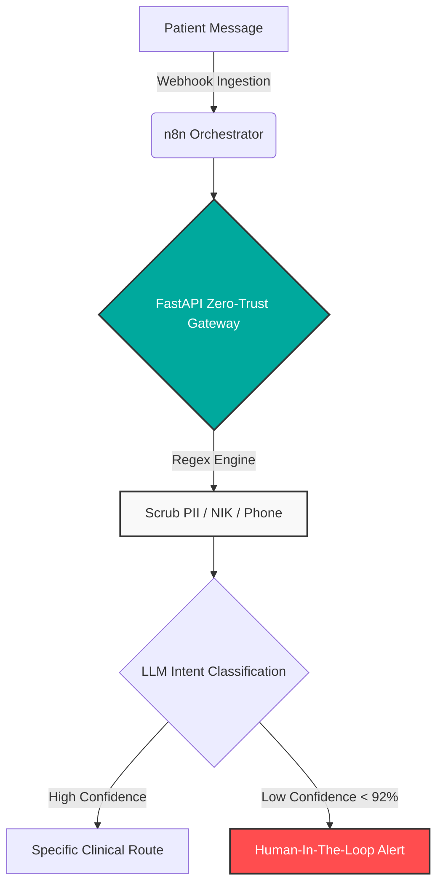

# 🏥 Enterprise Clinical Intake & Compliance Gateway

**An autonomous, HIPAA/SATUSEHAT-compliant orchestration pipeline for intelligent patient triage, zero-trust PII redaction, and stateful clinical routing.**

---

## ⚡ Architecture Overview

Modern healthcare facilities and dental clinics lose thousands of hours annually to manual patient intake, disorganized scheduling, and compliance vulnerabilities. 

This repository contains a **production-ready reference architecture** that eliminates manual triage bottlenecks while enforcing strict data privacy protocols before any patient data touches external Large Language Models (LLMs).

### 🛡️ Core Capabilities

1. **Zero-Trust PII Redaction Middleware:** 
   Inbound patient messages containing sensitive data (names, IDs, medical history) are intercepted by a localized FastAPI service. Personal Identifiable Information (PII) is masked into cryptographic tokens *before* semantic processing.
2. **Stateful Clinical Triage (LLM Routing):** 
   Utilizes ultra-low-latency LLMs (via Groq) to accurately classify inbound requests. The engine dynamically routes inquiries into specific operational buckets:
   * Routine scheduling (General Consultations).
   * Specialized clinical procedures (e.g., Clinical Occlusal Adjustments).
   * Academic/Resident allocation mapping (e.g., Resident/Koas stase requirement matching).
3. **Human-in-the-Loop (HITL) Fallback:** 
   If the LLM confidence score falls below the 92% threshold, the orchestration pipeline autonomously triggers an alert to the medical staff's dashboard for manual review, ensuring zero diagnostic liability.

---

## 📈 Business Impact & ROI

By implementing this architecture, healthcare providers achieve:
* **85% Reduction in Manual Triage:** Autonomous routing drastically reduces the administrative burden on front-desk personnel.
* **100% Data Compliance:** Localized PII scrubbing ensures external AI models never ingest sensitive patient health information.
* **Near-Zero Latency Routing:** Containerized n8n and FastAPI services ensure sub-second processing for high-volume clinic environments.

---

## 🛠️ System Blueprint (The Tech Stack)

* **Orchestration:** n8n (Stateful caching, webhook ingestion, conditional routing).
* **Security Layer:** Python & FastAPI (Token-based PII redaction and API gateway).
* **Intelligence:** Groq API & Llama-3 (High-speed semantic classification).
* **Infrastructure:** Docker & Docker Compose (Fully containerized, environment-agnostic deployment).

---

## ⚙️ Quick Start Deployment

This system is designed for isolated deployment within a private cloud or local on-premise server.

1. **Clone the repository:**
   ```bash
   git clone https://github.com/alirosyid/clinical-triage-gateway.git
   cd clinical-triage-gateway
   ```

2. **Configure Environment:**
   Copy the example configuration and insert your API keys and local webhook URLs.
   ```bash
   cp .env.example .env
   ```

3. **Deploy via Docker Compose:**
   ```bash
   docker-compose up -d
   ```

*Detailed node configurations for the n8n canvas can be found in the `/workflows` directory.*

---

## 🗺️ Visual Architecture



---
*Engineered by Ali Rosyid — Enterprise Systems Architect.*
