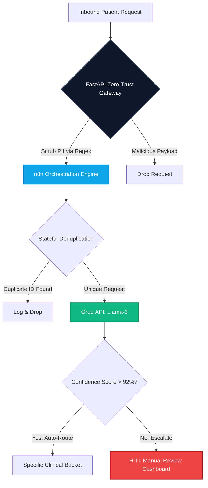

# 🏥 Enterprise Clinical Intake & Compliance Gateway

> **Executive Summary:** Download the complete business implementation and ROI blueprint here: [The AI Automation Blueprint (PDF)](The%20AI%20Automation%20Blueprint.pdf)

Zero-trust, HIPAA/SATUSEHAT compliant orchestration pipeline for intelligent patient triage, automated PII redaction, and stateful clinical routing.

## ⚡ Architecture Overview

Modern healthcare facilities and enterprise clinics lose thousands of hours annually to manual patient intake, generic scheduling, and compliance vulnerabilities. 

This repository is an implementation-ready reference architecture that intercepts, scrubs, and routes sensitive inbound communications in ultra-low latency before any patient data touches an external Large Language Model (LLM).

### 🔄 System Flow Diagram



### 🛡️ Core Capabilities

1. **Zero-Trust PII Redaction:** A localized FastAPI middleware intercepts inbound patient messages containing sensitive data (Names, IDs, Medical History). It automatically tokenizes and scrubs PII via Regex before hitting any external AI engines.
2. **Stateful Clinical Triage & LLM Routing:** Utilizes Llama-3 (via Groq API) for deterministic intent classification of requests. The engine dynamically routes inquiries into specific operational buckets:
   * General Scheduling & Consultations
   * Specialist Procedures
   * Emergency Escalation
3. **Stateful Deduplication (n8n Engine):** Advanced webhook orchestration that validates and drops duplicate requests within milliseconds, ensuring the database remains perfectly clean without processing redundant loops.
4. **Human-in-the-Loop (HITL) Fallback:** If the algorithm's confidence score falls below the 92% threshold, the automated pipeline autonomously flags the request and routes it to a human staff dashboard for manual review, ensuring zero diagnostic liability.

## 📈 Business Impact & ROI

Specific metrics targeted by implementing this pipeline architecture:

* **85% Reduction in Admin Overhead:** Triage and routing processes execute autonomously 24/7 without manual intervention.
* **100% Data Compliance:** Localized middleware ensures PII never leaves your secure server unencrypted or exposed.
* **Sub-Second Latency Routing:** Containerized infrastructure and Groq API guarantee lightning-fast response times.

## 🛠️ System Blueprint (The Tech Stack)

* **Orchestration:** n8n (Stateful routing, API integration, webhook handling)
* **Security Layer:** Python, FastAPI (Data scrubbing, regex tokenization)
* **Intelligence:** Groq API, Llama-3 (High-speed intent classification)
* **Infrastructure:** Docker, Docker Compose (Self-hosted, stateless/stateful isolated deployment)
* **CI/CD & Security:** GitHub Actions, Dependabot (Automated vulnerability scanning)

## 🚀 Quick Start Deployment

Deploying this pipeline locally for development and testing can be done via Docker.

**1. Clone the repository**
```bash
git clone https://github.com/alirosyid/clinical-triage-gateway.git
cd clinical-triage-gateway
```

**2. Configure Environment**
Copy the example configuration and insert your API keys and local webhook URLs.
```bash
cp .env.example .env
```

**3. Deploy via Docker Compose**
```bash
docker-compose up -d
```
